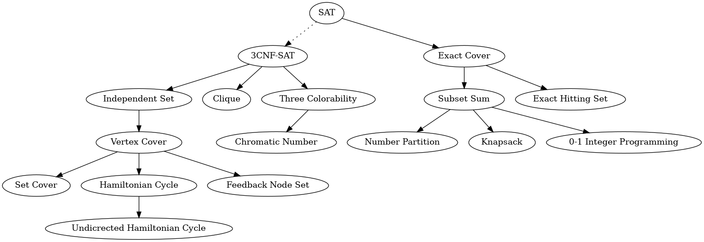

# Polynomial-Time Reductions in Isabelle/HOL
This repository sets out to formalize some classic results about NP-completeness in Isabelle/HOL.

## Using

The theories in this repository are developed with the current development version of [Isabelle](https://isabelle.in.tum.de) and the [AFP](https://www.isa-afp.org/download/).

For checking and browsing the theories, the following additional sessions are needed:
- [NREST](https://github.com/hydrogenoxide/NREST): make it available in the same way as the AFP, i.e., with `isabelle components -u /path/to/NREST`.

You have to tell Isabelle about the multiple sessions the project defines: `isabelle components -u /path/to/this/repository`.
Now, you can use `isabelle build -D .` in the root folder of this repository to check all sessions.

For browsing the theories, we recommend `isabelle jedit -l HOL-Analysis Poly_Reductions.thy &`.
The first startup will pre-build `HOL-Analysis`---which will take a while. All following invocations of Isabelle/JEdit will be quick.

If you want to look only at Karp's Reductions: `isabelle jedit -l HOL-Analysis Karp21/All_Reductions_Poly.thy &`.
If you want to look only at Cook Levin's Theorem: `isabelle jedit -l HOL-Analysis Cook_Levin_IMP/Complexity_classes/Cook_Levin.thy &`.

## Overview
The following reductions are currently formalized:

## Work Plan
A work plan is summarized [here](doc/PLAN.md).

## Index
### Polynomial-Time Reductions
So far the following classic reductions between NP-hard problems have been formalized:
- `Three_Sat_To_Set_Cover.thy`: 3CNF-SAT <= Independent Set <= Vertex Cover <= Set Cover
- `CNF_SAT_To_Clique.thy`: 3CNF-SAT <= Clique
- `HC_To_UHC.thy`: Hamiltonian Cycle <= Undicrected Hamiltonian Cycle
- `VC_To_FNS.thy`: Vertex Cover <= Feedback Node Set
- `VC_To_HC.thy`: Vertex Cover <= Hamiltonian Cycle

### Auxiliaries
- `VC_Set_To_VC_List.thy`: The representation of `Vertex Cover` using list makes the reduction from `Vertex Cover` to
  `Hamiltonian Cycle` easier. The rest of the repository uses the representation with sets.
- `List_Auxiliaries.thy` contains a definition of a sublist used to describe paths.
- `Graph_Auxiliaries.thy` and `Graph_Auxiliaries.thy` contain some basic lemmas used at different places.
- `Vwalk_Cycle.thy` contains a new definition of a cycle in a graph based on `vwalk`.
   The standard definition is based on `awalk`.

## NREST
For reasoning about the runtime complexity of the reductions, we use an [updated fork](https://github.com/hydrogenoxide/NREST) of [NREST](https://github.com/maxhaslbeck/NREST).
